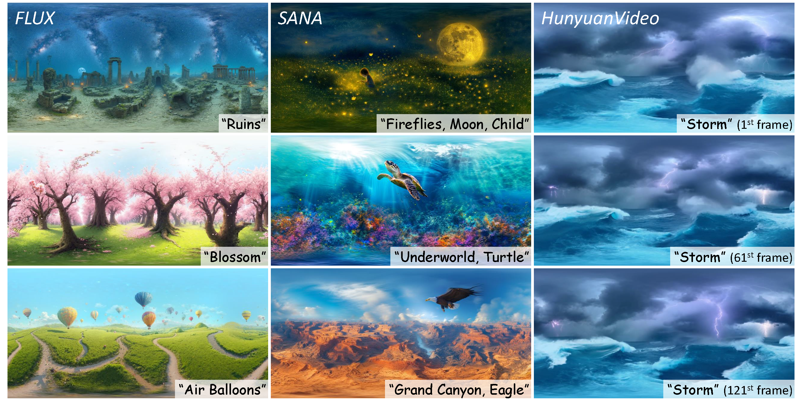

# SphereDiff: Tuning-free 360° Static and Dynamic Panorama Generation via Spherical Latent Representation

<p align="center">
  <a href="https://arxiv.org/abs/2504.14396">
    
  </a>
  <a href="https://pmh9960.github.io/SphereDiff/">
    
  </a>
  <a href="https://github.com/pmh9960/SphereDiff">
    
  </a>
</p>

> [Minho Park\*](https://pmh9960.github.io/), [Taewoong Kang\*](https://keh0t0.github.io/), [Jooyeol Yun](https://yeolj00.github.io/), [Sungwon Hwang](https://deepshwang.github.io/) and [Jaegul Choo](https://sites.google.com/site/jaegulchoo/)  
> Korea Advanced Institute of Science and Technology (KAIST)  
> AAAI 2026 (Oral). (\* indicate equal contribution)

## 🌐 Overview

**SphereDiff** enables **tuning-free generation of 360° panoramic images and videos** using pretrained diffusion models.  
Unlike ERP-based methods, SphereDiff defines a **spherical latent representation** to maintain consistent quality across all viewing directions.

**Key features:**

- 🌍 Spherical latent representation for distortion-free 360° generation
- 🌀 Supports both **static** and **dynamic** panoramas
- ⚙️ Plug-and-play with existing pretrained diffusion models
- 💡 No additional fine-tuning required

## 🎥 Demo



> Generated 360° Static and Dynamic Panoramas with Diverse Diffusion Backbones.

## 🚀 Example Usage

<details>
<summary>📦 Installation</summary>

```bash
conda create -n spherediff python=3.10

# install pytorch according to your cuda version
pip install torch==2.7.1 torchvision==0.22.1 torchaudio==2.7.1 --index-url https://download.pytorch.org/whl/cu128

# then, install requirements
pip install -r requirements.txt
```

</details>

### Run SphereDiff without any additional training!

```bash
task_name="StaticWallpapers"
pipeline_name="SphericalFluxPipeline"
default_config="
pipeline_cls=${pipeline_name}
pretrained_model_name_or_path=black-forest-labs/FLUX.1-dev
variant=None
mixed_precision=bf16
enable_model_cpu_offload=False
call_kwargs.n_spherical_points=26500
"
subdir="my_subdir"
txt_name="ruins"
prompt_txt_path="data/prompts/${txt_name}.txt"
save_path="./outputs/${task_name}/${pipeline_name}/${subdir}/${txt_name}"

python generate_static_wallpaper.py --config_add ${default_config} call_kwargs.prompt_txt_path=${prompt_txt_path} save_path=${save_path} ;
```

> See [./scripts/run_spherediff.md](./scripts/run_spherediff.md) for full options.

## 🚧 Planned Updates

- [x] Update the project page and arXiv link  
- [x] Release the base code for static & live wallpaper generation  
- [ ] Release the code for foreground–background generation  

## 📚 Citation

```bibtex
@article{park2025spherediff,
  title={SphereDiff: Tuning-free Omnidirectional Panoramic Image and Video Generation via Spherical Latent Representation},
  author={Park, Minho and Kang, Taewoong and Yun, Jooyeol and Hwang, Sungwon and Choo, Jaegul},
  journal={arXiv preprint arXiv:2504.14396},
  year={2025}
}
```
